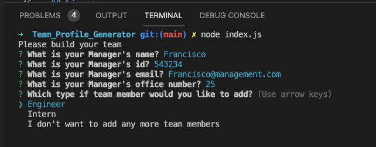
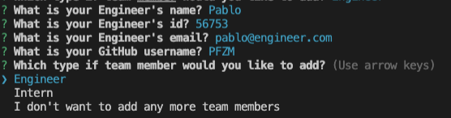
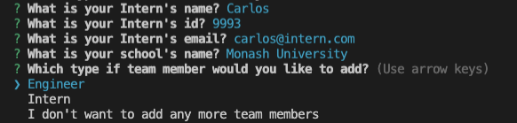
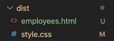
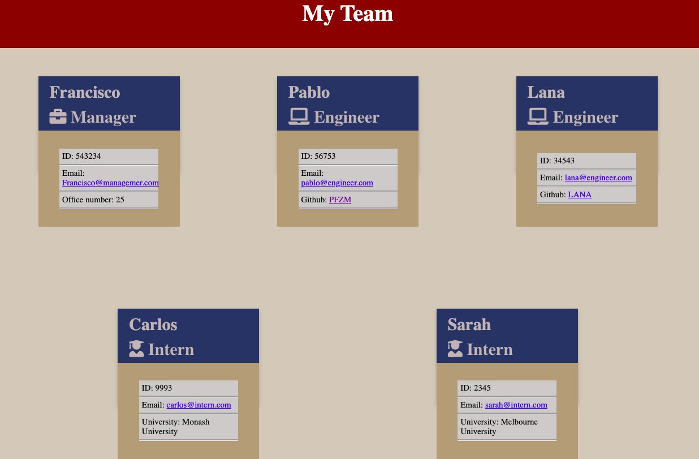
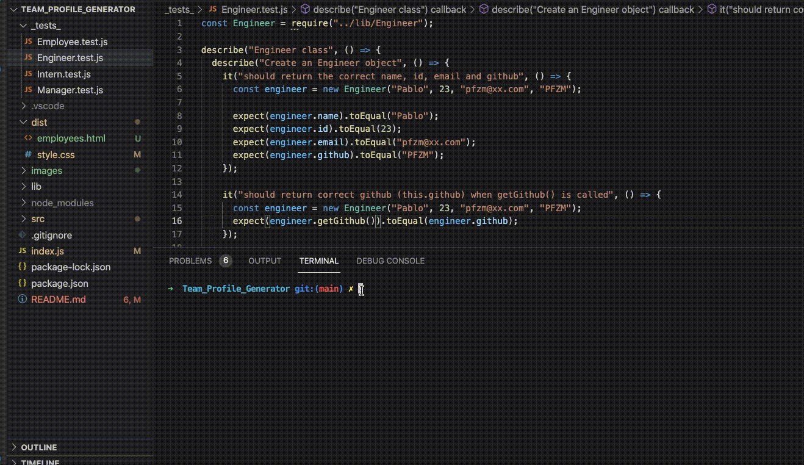

# README - TEAM PROFILE GENERATOR

[](https://opensource.org/licenses/MIT)

## Link to see the deployed application:

[YouTube video](https://youtu.be/ThEISjwUbnQ)

## Description

This is a node.js that generates an html with contact cards for employees of a specific team on a business by using a command-line application from a user's input using the [Inquirer package](https://www.npmjs.com/package/inquirer).

This app has been tested using the [Jest Testing Framework](https://jestjs.io/)

## Table of contents:

1. [Installation](#installation)
2. [Usage](#usage)
3. [License](#license)
4. [Contributing](#contributing)
5. [Test](test)
6. [Questions](#questions)

## Installation

1. Fork repository
2. Clone repository to local environment.
3. Node.js must be installed.
4. To install all the dependencies (Inquirer, Jest to perform tests) use the following command:

```bash
npm install
```

## Usage

The application is invoked by using the following command (on the directory containing this project):

```bash
node index.js
```

The following questions will be prompted asking for the Manager details, followed by a list of options to select to input the details of Engineer and Intern or to generate the html:



Engineer questions:



Intern questions:



HTML will be generated on 'dist' folder under the name 'employee.html':



Mockup for the generated html:



## License

This project is covered under the MIT license.

## Contributing

When contributing to this repository, please first discuss the change you wish to make via issue, email, or any other method with the owners of this repository before making a change.
Please note we have a code of conduct, please follow it in all your interactions with the project.
Contributions follow the [Contributor Convenant](http://contributor-covenant.org/version/1/4/).

## Test

100% test coverage on classes using Jest package.

To run test:

```bash
npm run test
```



## Questions

[GitHub profile](http://github.com/PFZM)

[Contact Me - Email](mailto:pfzm@hotmail.com)
